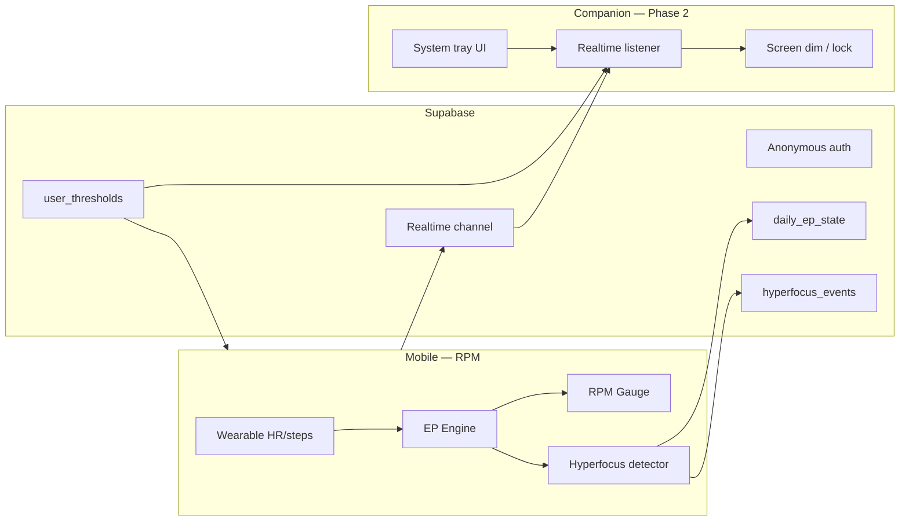

# Phase 2 — Companion App Architecture

Status: **design / pre-implementation** (after Phase 1 device validation).

## Goals

Phase 2 extends RPM from passive monitoring to **active intervention** when hyperfocus is detected:

1. **Companion desktop app** (Linux/macOS/Windows) paired with the mobile app
2. **Screen dim or soft lock** during sustained hyperfocus — user can override
3. **Configurable thresholds** (HR delta, duration, step ceiling) without app update
4. Preserve Phase 1 principles: zero-effort, system tone, no guilt patterns

## System context



## Monorepo placement (proposed)

```
apps/
  mobile/          # existing Expo app
  companion/       # Electron or Tauri shell
packages/
  ep-engine/       # shared — threshold evaluation
  shared-types/    # shared — HyperfocusCommand, ThresholdConfig
  companion-protocol/  # message schemas + Supabase channel contract
```

**Recommendation:** **Tauri 2** for companion — smaller binary, native screen APIs via Rust plugins, fits Linux-first workflow. Electron is fallback if Tauri screen-control plugins prove immature on Wayland.

## Communication contract

### Primary: Supabase Realtime (already scaffolded in mobile)

| Event | Direction | Payload |
|---|---|---|
| `hyperfocus_started` | mobile → companion | `{ sessionId, hrDelta, startedAt }` |
| `hyperfocus_cleared` | mobile → companion | `{ sessionId, endedAt }` |
| `companion_ack` | companion → mobile | `{ sessionId, action: "dim" \| "dismissed" }` |
| `threshold_updated` | mobile ↔ cloud | `ThresholdConfig` row per user |

Mobile remains **source of truth** for hyperfocus detection (wearable data stays on phone). Companion never reads Health Connect directly.

### Fallback: local pairing (optional Phase 2.1)

QR pairing + mDNS for LAN when Supabase unreachable. Out of scope until Realtime path is stable on device.

## Companion responsibilities

| Module | Responsibility |
|---|---|
| `PairingService` | Link companion install to Supabase user (same anonymous user or explicit link flow) |
| `RealtimeSubscriber` | Listen on `hyperfocus_events` for active user |
| `ScreenInterventionService` | OS-specific dim overlay or input lock with 3s escape hatch |
| `TrayController` | Status: connected / hyperfocus active / paused |
| `ThresholdSync` | Pull `user_thresholds`; push edits back to Supabase |

## Screen intervention UX

1. Mobile detects hyperfocus → push notification (Phase 1) + Realtime event
2. Companion receives event → **gradual dim** (30% → 60% over 10s), not instant black screen
3. Corner chip: *"Verhoogd toerental — tap Esc to override"*
4. User override → `companion_ack dismissed` → no re-trigger for 15 min
5. Hyperfocus clears on mobile → companion restores brightness

**Hard lock** (blocks input) is opt-in in settings — default is dim-only to avoid trapping users.

## Configurable thresholds (Supabase)

New table `user_thresholds` (Phase 2 migration):

```sql
-- sketch only — implement via reversible migration
user_id uuid primary key references profiles(id),
hyperfocus_hr_delta int not null default 20,
hyperfocus_min_minutes int not null default 20,
step_ceiling_per_min int not null default 10,
companion_dim_enabled boolean not null default true,
updated_at timestamptz not null default now()
```

Mobile EP engine reads merged config: `DEFAULT_RPM_CONFIG` overridden by user row. Changes apply next monitoring tick — no app restart.

## Security

- Companion stores **refresh token** in OS keychain (not plain file)
- Realtime channels scoped by RLS to `auth.uid()`
- Companion cannot trigger lock on another user's session
- Override always available — no dark-pattern lock-in

## Implementation order

1. **Device validate Phase 1** on Android APK (blocker)
2. Migration: `user_thresholds` + extend `hyperfocus_events` with `companion_notified_at`
3. Package `companion-protocol` (Zod schemas shared with mobile)
4. Mobile: emit Realtime events on hyperfocus state transitions
5. Tauri scaffold: tray + Realtime subscriber only (no dim yet)
6. Screen dim MVP on **X11 + Windows** first; Wayland plugin spike
7. Settings screen: threshold sliders (mobile) synced to Supabase
8. E2E test: mock hyperfocus → companion dim → override

## Out of scope (Phase 2)

- Forest mode / geofencing (Phase 3)
- History dashboard (Phase 4)
- LLM voice (Phase 3)
- Browser extension as companion (desktop app only)

## Open questions (resolve after APK test)

- Does hyperfocus detection feel accurate on real HR data?
- Is 20 min duration too long for first intervention?
- Do users want dim-only or lock on laptop?

---

*Owner: platform team — update after Phase 1 device retro.*
